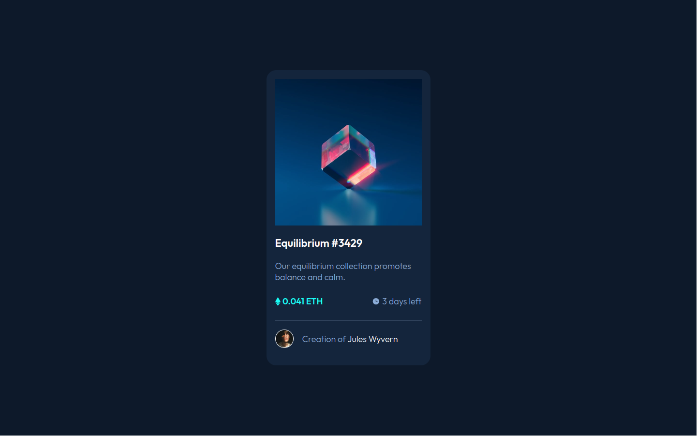

# Frontend Mentor - NFT preview card component solution

This is a solution to the [NFT preview card component challenge on Frontend Mentor](https://www.frontendmentor.io/challenges/nft-preview-card-component-SbdUL_w0U). Frontend Mentor challenges help you improve your coding skills by building realistic projects. 

## Table of contents

- [Overview](#overview)
  - [The challenge](#the-challenge)
  - [Screenshot](#screenshot)
  - [Links](#links)
- [My process](#my-process)
  - [Built with](#built-with)
  - [What I learned](#what-i-learned)
- [Author](#author)

## Overview

### The challenge

Users should be able to:

- View the optimal layout depending on their device's screen size
- See hover states for interactive elements

### Screenshot



### Links

- Solution URL: [Github repo](https://github.com/Mechelon404/FrontendMentor-NFTpreview)
- Live Site URL: [NFT preview live](https://mechelon404.github.io/FrontendMentor-NFTpreview/)

## My process

### Built with

- Semantic HTML5 markup
- CSS custom properties
- Flexbox

### What I learned

Biggest challenge was to position overlay correctly and add hover effect to image
```css
.overlay {
    position: absolute;
    width: 100%;
    height: 100%;
    top: 50%;
    left: 50%;
    transform:translate(-50%, -50%);
    display: flex;
    justify-content: center;
    align-items: center;
    transition: .5s ease;
}

.viewed-icon {
    opacity: 0;
    transition: .5s ease;
}

.overlay:hover {
    background-color: rgba(0,255,247,0.5);
    cursor: pointer;
}

.overlay:hover .viewed-icon {
    opacity: 1;
}
```

Learned how to style the horizontal html divider line
```css
hr {
    border-color: hsl(215, 32%, 27%);
    border-style: solid;
    margin: 0;
}
```
Learned how to create circular border around picture
```css
.avatar {
    width: 2em;
    height: 2em;
    margin: 1em 1em 1em 0;
    border: 1px solid hsl(0, 0%, 100%);
    border-radius: 50%;
}
```

## Author

- Website - [Mechelon404](https://github.com/Mechelon404)
- Frontend Mentor - [@yourusername](https://www.frontendmentor.io/profile/Mechelon404)